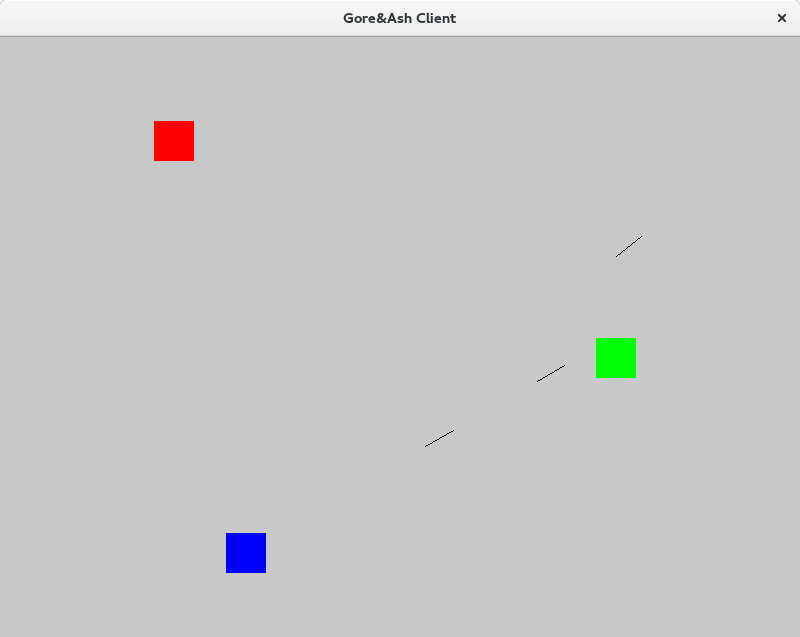
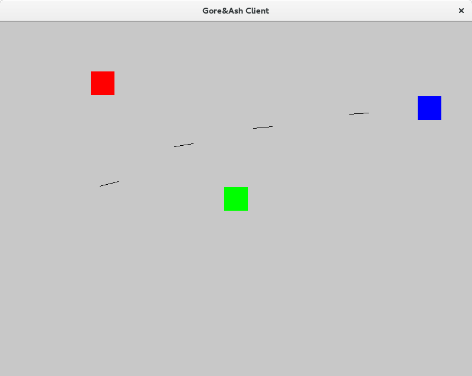

gore-and-ash-demo
=================

The repo contains proof-of-concept implementation of simple game with [Gore&Ash](https://github.com/Teaspot-Studio/gore-and-ash) engine.

Installation
============

1. Install `stack` from [stackage.net](http://www.stackage.org/);
2. Run `stack install` from root directory of the repo;
3. Start server `gore-and-ash-demo-server 0.0.0.0 5556`;
4. Start several clients with `gore-and-ash-demo-client localhost 5556`.

Screenshots
===========

